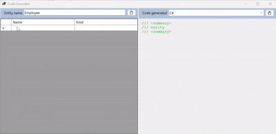

# CodeGenerator

## Description
It is a tool to create entities easily without having to write code.

>[!info]
>Project: Windows forms net9.0-windows
>Language: C#
>Arquiteture: MVP
>Patterns: Service, Repository
>Tests: xUnit

### How to use it
Just follow these steps:

1. Assign the entity a name

2. In the grid, assign a name and type to each property.

3. Press the Copy button to copy the resulting code.

4. Paste in your code

### Install fonts
To install the iconographic fonts just double click on each file 
and press the install button.

*Directory*
`CodeGenerator/fonts/Font Awesome 6 Brands-Regular-400.otf`
`CodeGenerator/fonts/Font Awesome 6 Free-Regular-400.otf`
`CodeGenerator/fonts/Font Awesome 6 Free-Solid-900.otf`

---

## Spanish
### Como usar la herramienta
Es una herramienta para crear entidades de forma facil 
sin tener que escribir codigo.

Solo sigue estos pasos:

1. Assigna un nombre a la entidad

2. En el grid, asigna nombre y tipo de cada propiedad

1. 3. Presiona el botón Copy para copiar el codigo resultante

4. Pegalo en tu código

### Instalar fuentes iconográficas
Para instalar las fuentes iconográficas solo de doble click en 
cada archivo y presione el botón instalar

*Directorio*
`CodeGenerator/fonts/Font Awesome 6 Brands-Regular-400.otf`
`CodeGenerator/fonts/Font Awesome 6 Free-Regular-400.otf`
`CodeGenerator/fonts/Font Awesome 6 Free-Solid-900.otf`